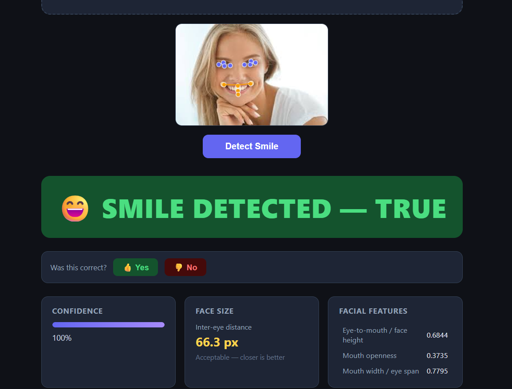

# 😊 Smile Detector

A web app that detects whether a person is smiling in a photo using **MediaPipe FaceLandmarker** for keypoint extraction and a **Logistic Regression** classifier trained on ratio-based facial features.



---

## Features

- **Smile detection** — upload any photo (JPG, PNG, WEBP, BMP) and get an instant smile/no-smile result
- **Confidence score** — visual confidence bar showing how certain the model is
- **Facial keypoints overlay** — 15 key landmarks drawn directly on the preview image
- **Facial feature metrics** — mouth width/eye span ratio, mouth openness, eye-to-mouth ratio, and more
- **User feedback loop** — thumbs up/down buttons let you correct wrong predictions
- **In-session retraining** — retrain the classifier on-the-fly using your collected feedback (feedback samples are weighted ×5)
- **Face size check** — warns when the face is too small for reliable detection (inter-eye distance < 30 px)

---

## Tech Stack

| Layer | Technology |
|---|---|
| Backend | Python · Flask |
| Face landmarks | MediaPipe FaceLandmarker (Tasks API v0.10+) |
| Classifier | scikit-learn `LogisticRegression` + `StandardScaler` |
| Image processing | OpenCV |
| Frontend | Vanilla JS · HTML5 Canvas · CSS |

---

## Project Structure

```
.
├── app.py                      # Flask server & API routes
├── detector.py                 # MediaPipe pipeline + classifier logic
├── data/
│   ├── facial_keypoints.json   # Labelled training data (smile / no-smile)
│   └── feedback.json           # User-submitted corrections (auto-generated)
├── models/
│   └── face_landmarker.task    # MediaPipe model file
├── static/
│   ├── css/style.css
│   └── js/main.js
└── templates/
    └── index.html
```

---

## Getting Started

### Prerequisites

- Python 3.9+
- pip

### Installation

```bash
# 1. Clone the repo
git clone <repo-url>
cd smile-detector

# 2. Install dependencies
pip install flask mediapipe scikit-learn opencv-python numpy

# 3. Run the app
python app.py
```

Open your browser at `http://localhost:5000`.

---

## API Reference

### `POST /detect`

Detect a smile in an uploaded image.

**Request:** `multipart/form-data` with field `photo` (image file, max 10 MB)

**Response:**
```json
{
  "smile": true,
  "confidence": 0.97,
  "low_confidence": false,
  "inter_eye_px": 66.3,
  "keypoints": { "left_eye_outer": [x, y], "..." : "..." },
  "features": {
    "mouth_w_eye_span_ratio": 0.7795,
    "mouth_openness": 0.3735,
    "eye_to_mouth_face_ratio": 0.6844
  },
  "error": null,
  "warning": null
}
```

---

### `POST /feedback`

Submit a correction for the last prediction.

**Request body:**
```json
{
  "keypoints": [[x, y], "..."],
  "correct_label": true
}
```

---

### `POST /retrain`

Retrain the classifier using original training data + all saved feedback.

---

### `GET /stats`

Returns the number of collected feedback samples.

```json
{ "feedback_count": 12 }
```

---

## How It Works

1. **Keypoint extraction** — MediaPipe FaceLandmarker detects 478 face landmarks; 15 anatomically relevant points (8 eye, 7 mouth) are selected.
2. **Feature engineering** — 8 scale-invariant ratio features are computed (e.g. mouth width / eye span, mouth openness, lower-face proportion).
3. **Classification** — A `StandardScaler` + `LogisticRegression` model trained on labelled keypoint data predicts smile probability.
4. **Feedback & retraining** — User corrections are stored in `data/feedback.json` and can be used to retrain the model in-session, with feedback samples weighted ×5 for stronger influence.

---

## License

MIT
